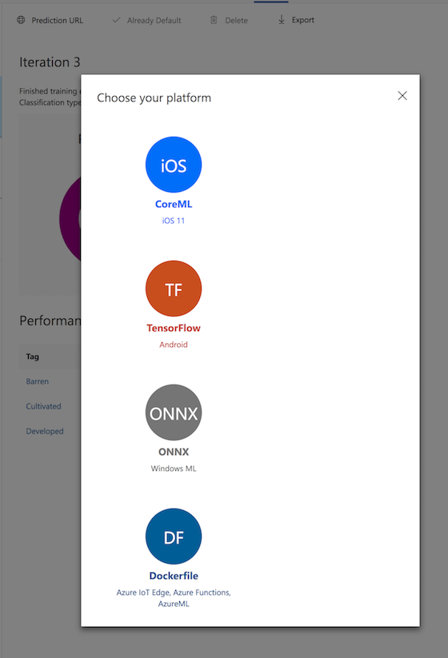

# Part 2 - Operationalization
Custom Vision Service allows classifiers to be exported to run offline. You can embed your exported classifier into an application and run it locally on a device for real-time classification.

Custom Vision Service supports the following exports:

- Tensorflow for Android.
- CoreML for iOS11.
- ONNX for Windows ML.
- A Windows or Linux container. The container includes a Tensorflow model and service code to use the Custom Vision Service API.

Custom Vision Service only exports compact domains. The models generated by compact domains are optimized for the constraints of real-time classification on low powered devices. Classifiers built with a compact domain may be slightly less accurate than a standard domain with the same amount of training data.

## Convert to a compact domain

If your classifier was not trained with the compact domain (which is the case for the classifier trained during the first stage of the lab) you need to convert it.

To convert the domain of an existing classifier, use the following steps:

1. From the Custom vision page, select the Home icon to view a list of your projects. You can also use the https://customvision.ai/projects to see your projects.
2. Select your project, and then select the Gear icon in the upper right of the page.
3. In the **Domains** section, select the `General (compact)` domain. **Save Changes** to save the changes.

4. Retrain the model using the `General (compact)` domain

5. Make this iteration the default iteration.

## Export the model 
You can use CVS web interface or REST API to export the model. To export the model through the web interface.

1. Go to the Performance tab and select Export.

2. You can now select the format and download the export package to your workstation.

 
