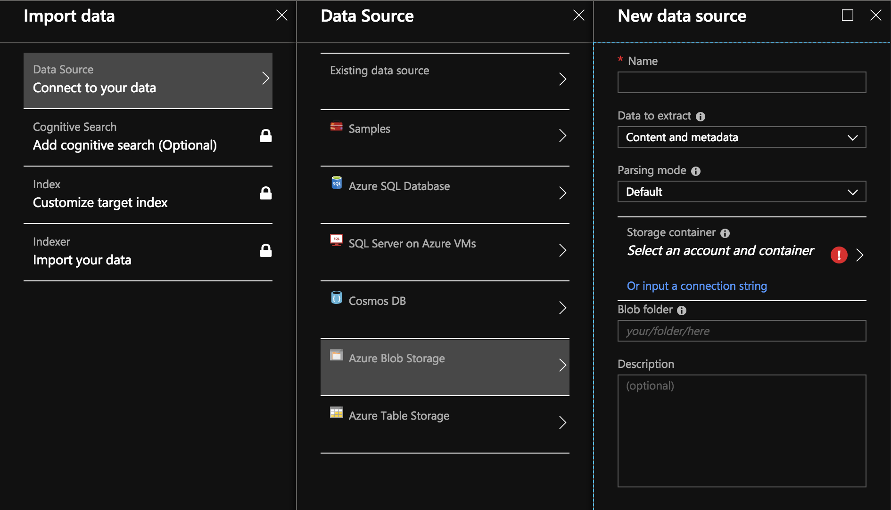

# 03. Create Indexer for Unstructured Data

## Create the enrichment pipeline ##
Go back to the Azure Search service dashboard page and click Import data on the command bar to set up enrichment in four steps.

## Step 1: Start the Import data wizard

1. From the Azure Search service dashboard, click **Import data** on the command bar to start the wizard. This wizard helps you create and populate a search index.

    

2. In the wizard, click **Connect to your data** > **Azure Blob Storage**. This data source is preconfigured with a name, type, and connection information. Once created, it becomes an "existing data source" that can be reused in other import operations.

    
In Connect to your data > Azure Blob storage, select the account and container you created. Give the data source a name, and use default values for the rest.

3. Click **OK** to use it.

One advantage of using the Import data wizard is that it can also create your index. As the data source is created, the wizard simultaneously constructs an index schema. It can take a few seconds to create the index.

## Step 2: Add cognitive skills ##
Next, add enrichment steps to the indexing pipeline. The portal gives you predefined cognitive skills for image analysis and text analysis. In the portal, a skillset operates over a single source field. That might seem like a small target, but for Azure blobs the content field contains most of the blob document (for example, a Word doc or PowerPoint deck). This field is an ideal input because all of a blob's content is there.

Sometimes you would like to extract the textual representation from files that are composed of mostly scanned images, like a PDF that gets generated by a scanner. Azure Search can automatically extract content from embedded images in the document. To do that, select the Enable OCR and merge all text into merged_content field option. This will automatically create a merged_contentfield that contains both the text extracted from the document as well as the textual representation of images embedded in the document. When you select this option the Source data field will be set to merged_content.

In Add cognitive skills, choose skills that perform natural language processing. For this quickstart, choose entity recognition for people, organizations, and locations.

Click OK to accept the definition.

Natural language processing skills operate over text content in the sample data set. Since we didn't select any image processing options, the JPEG files found in the sample data set won't be processed in this quickstart.

## Step 3: Configure the index ##

Remember the index that was created with the data source? In this step, you can view its schema and potentially revise any settings.
For this quickstart, the wizard does a good job setting reasonable defaults:
* Every index must have a name. For this data source type, the default name is azureblob-index.
* Every document must have a key. The wizard chooses a field having unique values. In this quickstart, the key is metadata_storage_path.
* Every field collection must have fields with a data type describing its values, and each field should have index attributes that describe how its used in a search scenario.
Because you defined a skillset, the wizard assumes that you want the source data field, plus the output fields created by the skills. For this reason, the portal adds index fields for content, people, organizations, and locations. Notice that the wizard automatically enables Retrievable and Searchable for these fields.
In Customize index, review the attributes on the fields to see how they are used in an index. Searchable indicates a field can be searched. Retrievable means it can be returned in results.
Consider clearing Retrievable from the content field. In blobs, this field can run into thousands of lines, difficult to read in a tool like Search explorer.
Click OK to accept the index definition.

## Step 4: Configure the indexer ##
The indexer is a high-level resource that drives the indexing process. It specifies the data source name, the index, and frequency of execution. The end result of the Import data wizard is always an indexer that you can run repeatedly.
In the Indexer page, give the indexer a name and use the default "run once" to run it immediately.
Click OK to import, enrich, and index the data.

Indexing and enrichment can take time, which is why smaller data sets are recommended for early exploration. You can monitor indexing in the Notifications page of the Azure portal.

## Query in Search explorer ##
After an index is created, you can submit queries to return documents from the index. In the portal, use Search explorer to run queries and view results.
1.	On the search service dashboard page, click Search explorer on the command bar.
2.	Select Change Index at the top to select the index you created.
3.	Enter a search string to query the index, such as "John F. Kennedy".
Results are returned in JSON, which can be verbose and hard to read, especially in large documents originating from Azure blobs.
If you can't scan results easily, use CTRL-F to search within documents. For this query, you could search within the JSON on "John F. Kennedy" to view instances of that search term.

CTRL-F can also help you determine how many documents are in a given result set. For Azure blobs, the portal chooses "metadata_storage_path" as the key because each value is unique to the document. Using CTRL-F, search for "metadata_storage_path" to get a count of documents. For this query, two documents in the result set contain the term "John F. Kennedy".

---
[04. Integrate Search into your Web App](04IntegrateintoApp.md)
