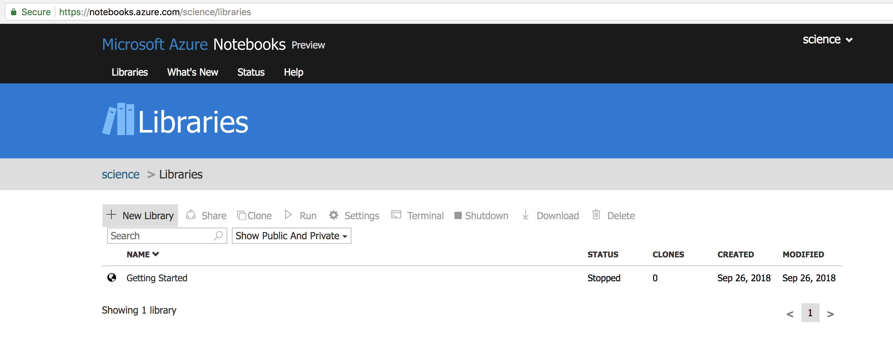
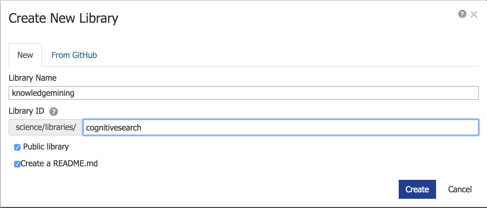
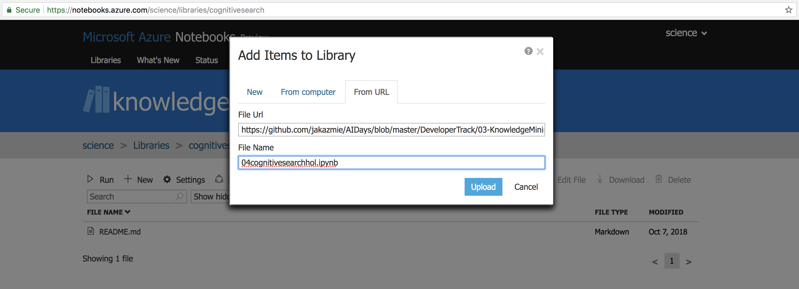

## 04. Integrate Search into your Web App

### 04.01. Access to Azure Notebooks

Go to your Notebook service runing on your Data Science Virtual Machine

> If you don't have Notebook service running you can
> go to [Azure Notebooks](https://notebooks.azure.com) for the rest of the lab

Click _'+ New Library'_ and create a new notebook



Use any name for _library_ but make sure use unique name for _Library ID_ and click _Create_ 



When new library is created, click '+ New', click _'From URL'_ tab and paste below url to the _'File Url'_ and click _'Upload'_

Use following url to import notebook

```
https://github.com/jakazmie/AIDays/blob/master/DeveloperTrack/03-KnowledgeMining/04cognitivesearchhol.ipynb
```



Open the notebook by click on the name of the notebook _'04cognitivesearchhol.ipynb'_ and continue the lab from the notebook

---
[05. Clean up](https://github.com/jakazmie/AIDays/blob/master/KnowledgeMining/05Cleanup.md)
