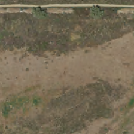

# Building a custom image classification solution with Custom Vision Service
In this lab you will train, evaluate, deploy, and use a custom image classification model using Microsoft Cognitive Services Custom Vision Service. 

The Custom Vision Service is an Azure Cognitive Service that lets you build custom image classifiers. It makes it easy and fast to build, deploy, and improve an image classifier. The Custom Vision Service provides a REST API and a web interface to upload your images and train the classifier.

The Custom Vision Service works best when the item you're trying to classify is prominent in your image.

Few images are required to create a classifier or detector. 50 images per class are enough to start your prototype. The methods Custom Vision Service uses are robust to differences, which allows you to start prototyping with so little data. This means Custom Vision Service is not well suited to scenarios where you want to detect subtle differences. For example, minor cracks or dents in quality assurance scenarios.

The lab is designed to be instructor guided.  In addition to walking you through the lab's steps, the instructor will explain key concepts and as necessary deep dive into technical details. 

Don't hesitate to ask questions !

## What will you learn during the lab?
The lab consists of 2 parts:
- In the first part you will learn how to train, evaluate, fine tune, and invoke a custom image classification model.
- In the the second part, you will export your model as a docker image so it can be deployed into an arbitrary inference environment

## Scenario

You will train a custom image classification model to automatically classify the type of land shown in aerial images of 224-meter x 224-meter plots. Land use classification models can be used to track urbanization, deforestation, loss of wetlands, and other major environmental trends using periodically collected aerial imagery. The images used in this lab are based on imagery from the U.S. National Land Cover Database. U.S. National Land Cover Database defines six primary classes of land use: *Developed*, *Barren*, *Forested*, *Grassland*, *Shrub*, *Cultivated*. For the sake of simplicity, in this lab you will train and operationalize a classifier to recognize three classes: *Barren*, *Developed*, *Cultivated*.  Example images in each land use class are shown here:

Developed | Cultivated | Barren
--------- | ------ | ----------
 |  | 

## Pre-requisities
- An Azure subscription
- Internet browser - preferably Chrome

## Lab environment

During the lab you will use Microsoft Cognitive Services Custom Vision Services web interface, Custom Vision Service Python SDK and Azure Notebooks.

### Provision and configure Custom Vision Service

In this step you will provision Custom Vision Service:

1. Navigate to Custom Vision Service web portal

https://customvision.ai

2. Sign in with you Azure account

3. On the Custom Vision Service's home page click on **NEW PROJECT**

4. In the **NEW PROJECT** dialog box select *Classification* for the project type, *Multiclass* for the classification type, and *General* for the domain type. Then click on **create new** *Resource Group*

  
6. Click on *Keys*. You will need one of the keys later in the lab. 

Congratulations! Your lab environment is ready.

Navigate back to the Jupyter Lab and start `train.ipynb` notebook.

