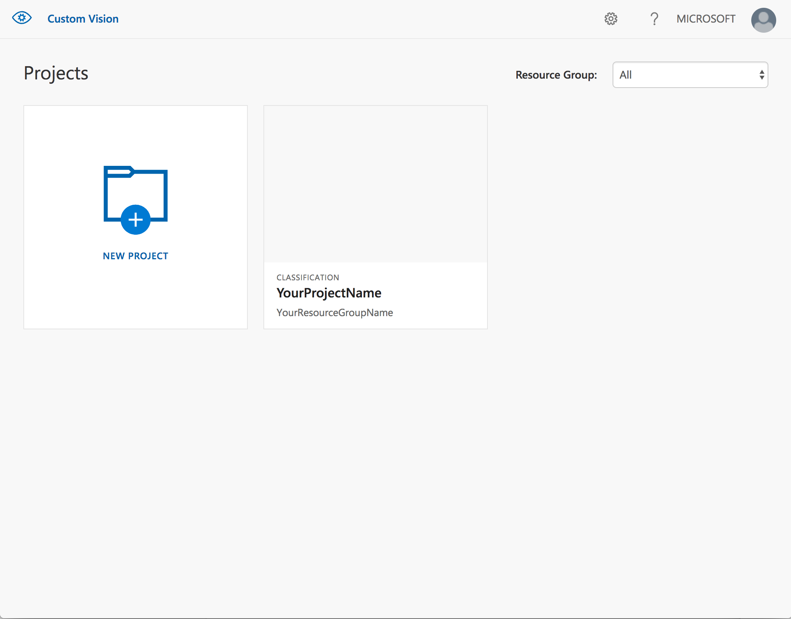
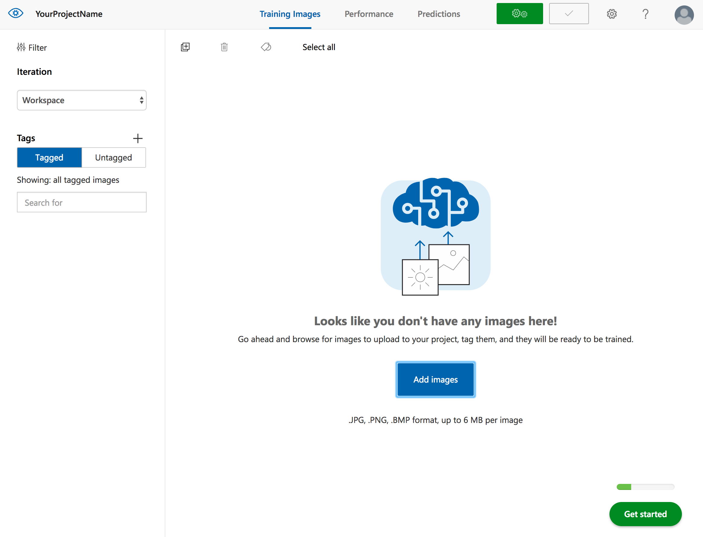

# Model training 
In this step you will train, evaluate, and fine tune a custom image classification model using Custom Vision Service Web GUI. Note that it is also possible to script the modelling workflow using Custom Vision Service SDK. 
## Prepare training data
The dataset used in this exercise can be downloaded from:

https://github.com/Microsoft/MTC_AzureAILabs/raw/master/Lab01-CustomVisionService/Dataset/AerialSmall.zip

Download and unzip it to a local folder on your workstation.

## Upload and tag training images
1. Navigate to the project section of Custom Vision Service Web GUI.

https://customvision.ai/projects

2. Click on the project you created in the lab set up step.

3. To add the first set of images to your project, use the **Add images** button. Navigate to `AerialSmall/train/Barren` and select and add all images.

4. To set the tag, enter *Barren* in the **My Tags** field. 

5. Repeat for images in `Cultivated` and `Developed` subfolders, using the respective tags.

## Train and evaluate the first iteration of the model
1. To train the classifier, click on the **Train** button.

2. After training is completed you will see the screen with the evaluation metrics. Your instructor will explain how to interpret the metrics.

## Test your model
1. You can perform a quick test of the model on unseen data by clicking the **Quick Test** button located to the right of the **Train**. This action opens a window labeled **Quick Test**.
2. In the **Quick Test** window click the Browse local files button and select a local image file. The testing images for our lab can be found in `AerialSmall/test`

## Improve the model
You can use many strategies to improve performance of your model. Your instructor will elaborate on the most common techniques. 

In the following steps you will apply two approaches. First you will review your training data looking for potentially mislabeled instances. Second, you will add more samples of the class for which the classifier did not perform well. 

Recall that the images tagged as *Developed* had the lowest **Precision** metrics. As such we will focus on improving the performace of our classifier on this class first.

1. Browse through the images labeled as *Developed*. You will notice some images with questionable tagging.

2. You can re-label the image(s) by selecting it and clicking on the **Tag images** button. Re-label the images in question to the class that in your opinion is the right label.

3. You will also add additional images to the *Developed* class. You can find them in `AerialSmall/train/Developed-SecondBatch`. Select and label all images from that folder.

4. Click on **Train** button to retrain the model. You will notice the second iteration of the model after the training is completed. Your instructor will explain the concept of the iteration in more detail. 

5. Review the new evaluation metrics. Both **Precision** and **Recall** should be higher. Note that your numbers may be slightly different than ours.

Congratulations. You have developed an accurate custom image classifier.

[Next step](https://github.com/Microsoft/MTC_AzureAILabs/tree/master/Lab01-CustomVisionService/Exercise2-Predict)

