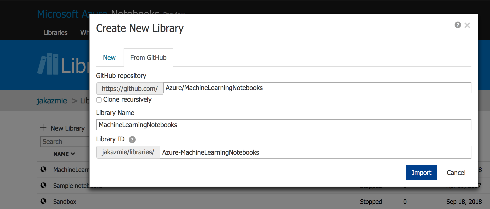

# Azure Machine Learning service walkthrough

Azure Machine Learning service is a cloud service that you can use to develop and deploy machine learning models. Using Azure Machine Learning service, you can track your models as you build, train, deploy, and manage them, all at the broad scale that the cloud provides.

For more detailed overview visit

https://docs.microsoft.com/en-us/azure/machine-learning/service/overview-what-is-azure-ml

This lab is an end-to-end walkthrough of Azure Machine Learning service. You will train, evaluate, fine tune and deploy a  machine learning model using Azure ML Python SDK and Azure Notebooks. 

The walkthrough is based on AML Quickstart and Tutorial.

## Pre-requisites
- An Azure subscription
- Internet browser - Chrome preferred

## Lab environment set up

1. Navigate to Azure Notebooks AML import page:
https://aka.ms/aml-clone-azure-notebooks

2. Click on **Import**

3. Sign in with your Azure account:

4. Click on **Import**. This will create Azure Notebooks Library with walkthrough files

Your environment is ready.

Follow the instructor who will walk you through the exercises.

